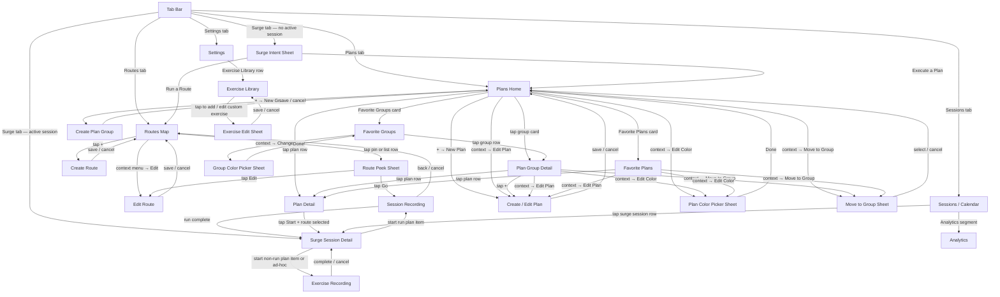

# surge15 — Screen Navigation Graph

## Full Graph

---

## Per-Screen Breakdown

### 1. Routes Map Screen
**Reachable from:** Routes tab

| Action | Goes to | Nav type |
|---|---|---|
| Tap map pin or list row | Route Peek Sheet | Overlay |
| Tap + | Create Route | Sheet |
| Context menu → Edit | Edit Route | Sheet |

**Full reachable set:** Route Peek Sheet → Session Recording → Surge Session Detail → Exercise Recording; Edit Route; Create Route

---

### 2. Route Peek Sheet
**Reachable from:** Routes Map

| Action | Goes to | Nav type |
|---|---|---|
| Tap Go | Session Recording | Push (via dismiss + deferred nav) |
| Tap Edit | Edit Route | Sheet |
| Tap outside / drag down | Routes Map | Dismiss |

**Full reachable set:** Session Recording → Surge Session Detail → Exercise Recording; Edit Route

---

### 3. Create Route
**Reachable from:** Routes Map (+ button)

| Action | Goes to | Nav type |
|---|---|---|
| Save or Cancel | Routes Map | Dismiss sheet |

**Full reachable set:** Routes Map only

---

### 4. Edit Route
**Reachable from:** Routes Map (context menu), Route Peek Sheet

| Action | Goes to | Nav type |
|---|---|---|
| Save or Cancel | Routes Map | Dismiss sheet |

**Full reachable set:** Routes Map only

---

### 5. Plans Home
**Reachable from:** Plans tab

| Action | Goes to | Nav type |
|---|---|---|
| Tap group card | Plan Group Detail | Push |
| Tap plan row | Plan Detail | Push |
| + → New Plan | Create / Edit Plan | Sheet |
| + → New Group | Create Plan Group | Sheet |
| Favorite Groups card | Favorite Groups | Push |
| Favorite Plans card | Favorite Plans | Push |
| Context → Edit Plan | Create / Edit Plan | Sheet |
| Context → Edit Color | Plan Color Picker | Sheet |
| Context → Add to Group | Move to Group Sheet | Sheet |

**Full reachable set:** Plan Group Detail → Plan Detail → Surge Session Detail → Session Recording + Exercise Recording; Create / Edit Plan; Create Plan Group; Favorite Groups → Plan Group Detail; Favorite Plans → Plan Detail; Plan Color Picker; Move to Group Sheet

---

### 6. Plan Group Detail
**Reachable from:** Plans Home, Favorite Groups

| Action | Goes to | Nav type |
|---|---|---|
| Tap plan row | Plan Detail | Push |
| Tap + | Create / Edit Plan | Sheet |
| Context → Edit Plan | Create / Edit Plan | Sheet |
| Context → Edit Color | Plan Color Picker | Sheet |
| Context → Move to Group | Move to Group Sheet | Sheet |

**Full reachable set:** Plan Detail → Surge Session Detail → Session Recording + Exercise Recording; Create / Edit Plan; Plan Color Picker; Move to Group Sheet

---

### 7. Favorite Groups
**Reachable from:** Plans Home (smart card)

| Action | Goes to | Nav type |
|---|---|---|
| Tap group row | Plan Group Detail | Push |
| Context → Change Color | Group Color Picker | Sheet |

**Full reachable set:** Plan Group Detail → Plan Detail → Surge Session Detail → Session Recording + Exercise Recording; Group Color Picker

---

### 8. Favorite Plans
**Reachable from:** Plans Home (smart card)

| Action | Goes to | Nav type |
|---|---|---|
| Tap plan row | Plan Detail | Push |
| Context → Edit Plan | Create / Edit Plan | Sheet |
| Context → Edit Color | Plan Color Picker | Sheet |
| Context → Move to Group | Move to Group Sheet | Sheet |

**Full reachable set:** Plan Detail → Surge Session Detail → Session Recording + Exercise Recording; Create / Edit Plan; Plan Color Picker; Move to Group Sheet

---

### 9. Create / Edit Plan
**Reachable from:** Plans Home, Plan Group Detail, Favorite Plans (all via sheet)

| Action | Goes to | Nav type |
|---|---|---|
| Save or Cancel | Calling screen | Dismiss sheet |

**Full reachable set:** Calling screen only

---

### 10. Create Plan Group
**Reachable from:** Plans Home (+ → New Group)

| Action | Goes to | Nav type |
|---|---|---|
| Save or Cancel | Plans Home | Dismiss sheet |

**Full reachable set:** Plans Home only

---

### 11. Plan Detail
**Reachable from:** Plans Home, Plan Group Detail, Favorite Plans

| Action | Goes to | Nav type |
|---|---|---|
| Tap Start (route selected) | Surge Session Detail | Tab jump (Sessions tab) |

**Full reachable set:** Surge Session Detail → Session Recording + Exercise Recording

---

### 12. Surge Session Detail
**Reachable from:** Plan Detail (Start), Sessions/Calendar (row tap), Surge tab (active session), Session Recording (after completing a run)

| Action | Goes to | Nav type |
|---|---|---|
| Start run plan item | Session Recording | Push |
| Start non-run / ad-hoc exercise | Exercise Recording | Sheet |
| Stop workout | Surge Session Detail (ended state) | — |

**Full reachable set:** Session Recording → back here; Exercise Recording → back here

---

### 13. Session Recording (GPS Run)
**Reachable from:** Route Peek Sheet (Go), Surge Session Detail (run plan item)

| Action | Goes to | Nav type |
|---|---|---|
| Run complete | Surge Session Detail | Pop / tab jump |
| Cancel / back | Routes Map or Surge Session Detail | Pop |

**Full reachable set:** Surge Session Detail → Exercise Recording

---

### 14. Exercise Recording
**Reachable from:** Surge Session Detail (non-run plan item or ad-hoc + button)

| Action | Goes to | Nav type |
|---|---|---|
| Complete or Cancel | Surge Session Detail | Dismiss sheet |

**Full reachable set:** Surge Session Detail only

---

### 15. Sessions / Calendar
**Reachable from:** Sessions tab

| Action | Goes to | Nav type |
|---|---|---|
| Tap surge session row | Surge Session Detail | Push |
| Analytics segment | Analytics | Inline swap |

**Full reachable set:** Surge Session Detail → Session Recording + Exercise Recording; Analytics

---

### 16. Analytics
**Reachable from:** Sessions / Calendar (segment toggle)

| Action | Goes to | Nav type |
|---|---|---|
| Calendar segment | Sessions / Calendar | Inline swap |

**Full reachable set:** Sessions / Calendar only

---

### 17. Settings
**Reachable from:** Settings tab

| Action | Goes to | Nav type |
|---|---|---|
| Exercise Library row | Exercise Library | Push |

**Full reachable set:** Exercise Library → Exercise Edit Sheet

---

### 18. Exercise Library
**Reachable from:** Settings

| Action | Goes to | Nav type |
|---|---|---|
| Tap to add / edit custom exercise | Exercise Edit Sheet | Sheet |

**Full reachable set:** Exercise Edit Sheet → back here

---

### 19. Exercise Edit Sheet
**Reachable from:** Exercise Library

| Action | Goes to | Nav type |
|---|---|---|
| Save or Cancel | Exercise Library | Dismiss sheet |

**Full reachable set:** Exercise Library only

---

## Sheets vs Pushes at a Glance

| Screen | Presented as |
|---|---|
| Route Peek Sheet | Overlay (custom, not a sheet) |
| Create Route | Sheet |
| Edit Route | Sheet |
| Create / Edit Plan | Sheet |
| Create Plan Group | Sheet |
| Plan Color Picker | Sheet |
| Group Color Picker | Sheet |
| Move to Group | Sheet |
| Exercise Edit Sheet | Sheet |
| Exercise Recording | Sheet |
| Surge Intent | Sheet (fixed height) |
| Surge Session Detail (Surge tab) | Sheet |
| Plan Group Detail | Push |
| Plan Detail | Push |
| Favorite Groups | Push |
| Favorite Plans | Push |
| Session Recording | Push |
| Surge Session Detail (Sessions tab) | Push |
| Analytics | Inline (segment swap, same screen) |
| Exercise Library | Push |
